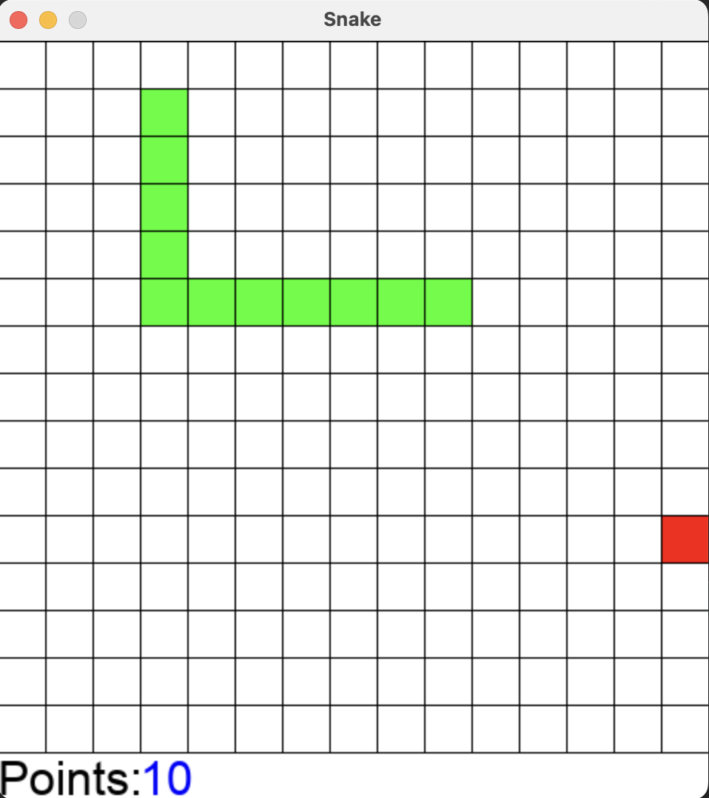

# Simple Mini Games

## Project Description

Several simple mini-games coded in Python using the Pygame library. The games include snake, tic-tac-toe, and pong.
I created this project for my Capstone Project which is required for grade 12 graduation in British Columbia, Canada.
The games can be controlled using keyboard inputs for snake and pong, and mouse inputs for tic-tac-toe. This was one
of the first full projects I completed as I was self-teaching Python.

[//]: # (![Example Tic Tac Toe]&#40;data/Example Tic Tac Toe.png&#41;)

[//]: # (![Example Pong]&#40;data/Example Pong.png&#41;)